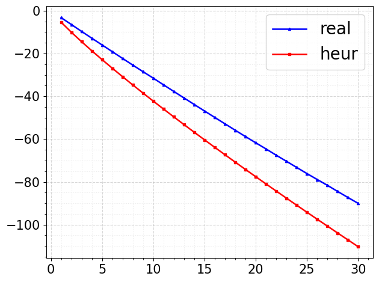

# Anonymous Submission — Code & Experimental Artifacts

This repository contains the code and experimental artifacts accompanying an anonymous paper submission on **primal-embedding lattice attacks on LWE**, with an emphasis on strengthening the **tail step** via an additional **middle dual-HKZ-style preprocessing** stage and validating a **tail-projection distribution model**.

The repo is organized by paper-section artifacts under `src/`.

---

## Repository layout

- [`src/4.Lemma/`](src/4.Lemma)  
  Empirical comparison of **measured** vs **heuristic** log tail-volume behavior after HKZ reduction.  
  - Code: `tail_vol_HKZ.py`  
  - Plots: `Result/Lemma3_fixed_dim.png`, `Result/Lemma3_fixed_k.png`

- [`src/5.Experimental%20Result/`](src/5.Experimental%20Result)  
  End-to-end experimental pipeline (BKZ → middle dual-HKZ-like → tail HKZ) and **chi-square validation** for normalized tail projections.  
  - Code: `compute_final_basis.py`, `Expermient.py`, `utility.py`  
  - Plots: `Result/Experiement_Result_cbd.png`, `Result/Experiment_Result_dg.png`

- [`src/6.Estimator/`](src/6.Estimator)  
  Parameter estimators for the minimum BKZ block size **β**, using either **GSA** or **ZGSA** spectrum models.

Each folder also contains a dedicated README with more details.

---

## Key experimental figures (included in this repo)

### Lemma-level tail-volume comparison (HKZ)

**Fixed dimension, varying tail size**  

**Fixed tail size, varying dimension**  

---

### Chi-square validation for normalized tail projection

We test the statistic: S = ||proj_{U_tail}(t)||^2 / sigma_eff^2

and compare the empirical CDF of \(S\) against the model CDF \(\chi^2_\tau\), for both CBD- and DG-sampled integer vectors.

**CBD test vectors**  

**DG test vectors**  

---

## Dependencies

### For `src/4.Lemma` and `src/5.Experimental Result`
- Python 3.10+
- `numpy`, `matplotlib`
- `fpylll`
- `mpmath` (chi-square CDF)
- `sympy` (exact unimodular inverse utilities)
- **SageMath** is recommended/expected for parts of the pipeline (some scripts import `sage.all`).
- External `fplll` binary (invoked by scripts). The code currently expects:
  - `../local/bin/fplll`
  - `../local/strategies/default.json`

> If your `fplll` path differs, update the subprocess calls accordingly.

### For `src/6.Estimator`
- Python 3.10+ (mostly standard library).  
  Some parts may assume Sage-style numeric types; run under Sage or replace with standard Python equivalents.

---
