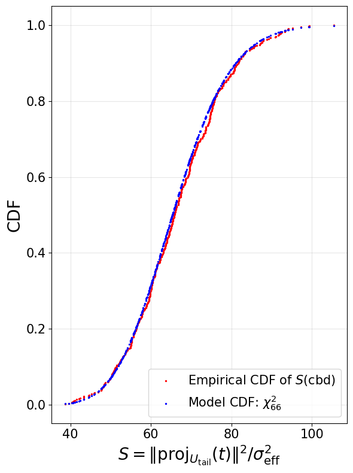

# 5.ExperimentResult

This directory contains the experimental code for:

1) Running a strengthened **primal-embedding** reduction pipeline for LWE  
   (**BKZ → middle dual-HKZ-like preprocessing → terminal tail HKZ**), and  

2) Empirically validating a **chi-square surrogate model** for the normalized tail-projection energy
\[
S \;=\; \|\mathrm{proj}_{U_{\mathrm{tail}}}(t)\|^2 / \sigma_{\mathrm{eff}}^2,
\]
using both CBD- and DG-sampled integer test vectors.

> **Convention:** All bases are stored as **row vectors** (row-basis convention).

---

## Contents

- `compute_final_basis.py`  
  End-to-end pipeline:
  generates an LWE instance, constructs the primal embedding lattice basis, runs LLL + BKZ-β (via external `fplll`),
  then applies a **middle dual-HKZ-like step** and a **terminal tail HKZ** step, and returns the updated basis. 

- `Expermient.py`  
  Validation of the chi-square surrogate:
  samples integer target-like vectors (DG or CBD), projects them onto the **tail subspace** induced by the reduced basis,
  forms \(S\), and compares the **empirical CDF** of \(S\) to the model CDF \(\chi^2_\tau\) (also reports KS distance). 

- `utility.py`  
  Helpers:
  - DG/CBD samplers (`dgb_sigma`, `cbd_eta`),
  - cost/time-matching `find_k` (MATZOV estimator),
  - QR helper for row-basis (`qr_R_from_row_basis`),
  - exact unimodular inverse (`unimodular_invers_Z`),
  - conversion helpers and augmentation utilities.

- `Result/`  
  Experimental plots (including chi-square validation figures shown below).
### CBD test vectors


### DG test vectors

---

## Requirements

### Core
- SageMath (the code imports `sage.all` and uses Sage integer utilities).
- Python packages:
  - `numpy`, `matplotlib`
  - `fpylll`
  - `sympy` (exact inversion of unimodular matrices)
  - `mpmath` (regularized incomplete gamma for χ² CDF) 
  - `lattice-estimator` (MATZOV cost model used in `find_k`)

### External binary
- `fplll` is called at `../local/bin/fplll`
- BKZ strategy JSON at `../local/strategies/default.json` 

## How to run

### Example: chi-square surrogate validation (`Expermient.py`)

In `Expermient.py`, set the `__main__` block like this:

```python
if __name__ == "__main__":
    from compute_final_basis import compute_final_basis
    from utility import find_k

    # parameters (toy default)
    n = 100
    m = 100
    q = 257
    beta = 40

    # 1) Run reduction pipeline and obtain the final reduced basis (row-basis convention)
    B_final = compute_final_basis(n, m, q, beta)
    print("Complete the reduction.")

    # 2) Decide tail dimension tau = beta + k
    d = n + m + 1
    k = find_k(beta, d)
    tau = beta + k

    # 3) Validate chi-square surrogate with DG/CBD test vectors and save plots
    res_dg = validate_tail_projection_chi2(B_final, tau=tau, dist="dg",  N=500, seed=1)
    res_cbd = validate_tail_projection_chi2(B_final, tau=tau, dist="cbd", N=500, seed=1)
```
